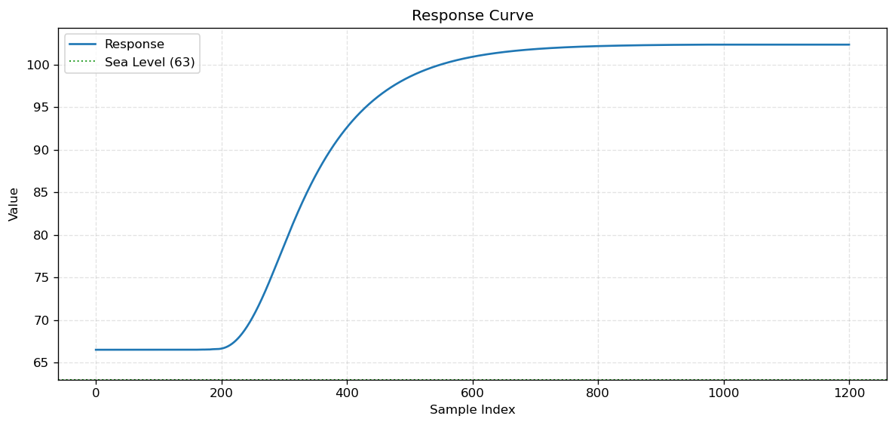
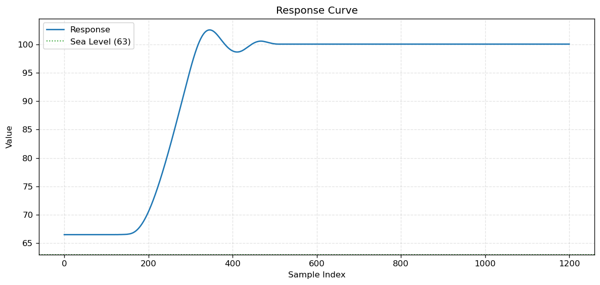
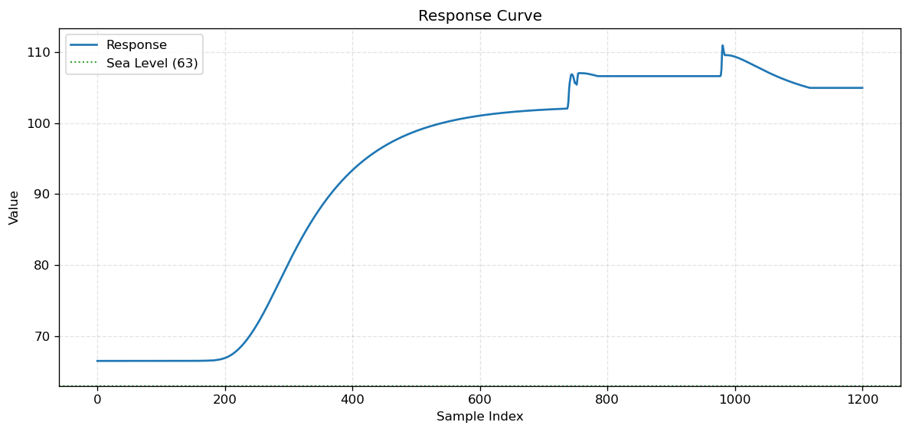
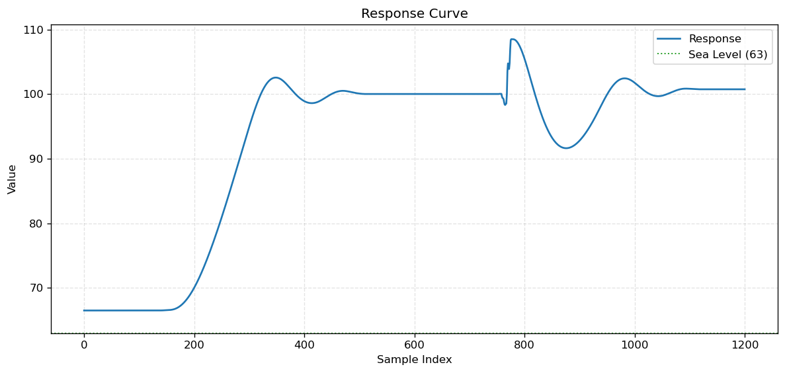

# AeronauticsPidFireBallon

机械动力航空学PID热气球

## 使用方法

1. 用蓝图将`pid_ballon.nbt`打印出来并物理化。
2. 将`controller.lua`和`tothesky.lua`放到左边的电脑中，`data.lua`放到右边的电脑中
3. 在右边电脑输入指令`data`，左边电脑输入指令`controller`
4. 等待两分钟后，系统应当稳定，并且右边电脑应该采集到数据，使用脚本`plot_response.py`可以绘制其对应响应曲线图。

## 响应曲线图

1. 开环控制（设定红石信号13）
  
2. 闭环控制
  
3. 开环控制（设定红石信号13，有干扰）
  
4. 闭环控制（有干扰）
  
